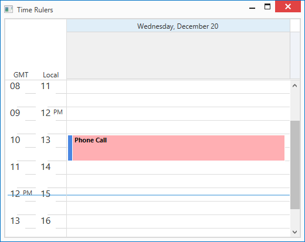

<!-- default badges list -->

<!-- default badges end -->

# WPF Scheduler - Generate Time Rulers From a View Model Collection

This example generates [time rulers](https://docs.devexpress.com/WPF/404183/controls-and-libraries/scheduler/visual-elements/time-ruler) from a collection. The [DayViewBase.TimeRulersSource](https://docs.devexpress.com/WPF/DevExpress.Xpf.Scheduling.DayViewBase.TimeRulersSource) property specifies the collection of objects that describe time ruler elements. The [DayViewBase.TimeRulerTemplate](https://docs.devexpress.com/WPF/DevExpress.Xpf.Scheduling.DayViewBase.TimeRulerTemplate) property allows you to define a data template used to generate time rulers. You can create a style for the [TimeRulerCellControl](https://docs.devexpress.com/WPF/DevExpress.Xpf.Scheduling.Visual.TimeRulerCellControl) to customize generated time rulers.

The [DayViewBase.TimeRulers](https://docs.devexpress.com/WPF/DevExpress.Xpf.Scheduling.DayViewBase.TimeRulers) collection stores all time rulers for the current view. You can also use collection members to add, modify, or remove time rulers.
  
 

## Files to Review

* [MainWindow.xaml](./CS/WpfSchedulerTimeRulers/MainWindow.xaml)
* [MainViewModel.cs](./CS/WpfSchedulerTimeRulers/MainViewModel.cs) (VB: [MainViewModel.vb](./VB/WpfSchedulerTimeRulers/MainViewModel.vb))

## Documentation

* [Time Ruler](https://docs.devexpress.com/WPF/404183/controls-and-libraries/scheduler/visual-elements/time-ruler)
* [TimeRuler](https://docs.devexpress.com/WPF/DevExpress.Xpf.Scheduling.TimeRuler)
* [DayViewBase.TimeRulersSource](https://docs.devexpress.com/WPF/DevExpress.Xpf.Scheduling.DayViewBase.TimeRulersSource)
* [DayViewBase.TimeRulerTemplate](https://docs.devexpress.com/WPF/DevExpress.Xpf.Scheduling.DayViewBase.TimeRulerTemplate)

## More Examples

* [WPF Scheduler - Use Styles and Templates to Customize Time Rulers](https://github.com/DevExpress-Examples/wpf-scheduler-use-styles-and-templates-to-customize-time-rulers)
<!-- feedback -->
## Does this example address your development requirements/objectives?

 

(you will be redirected to DevExpress.com to submit your response)
<!-- feedback end -->
